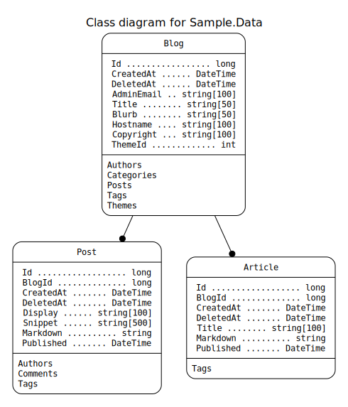
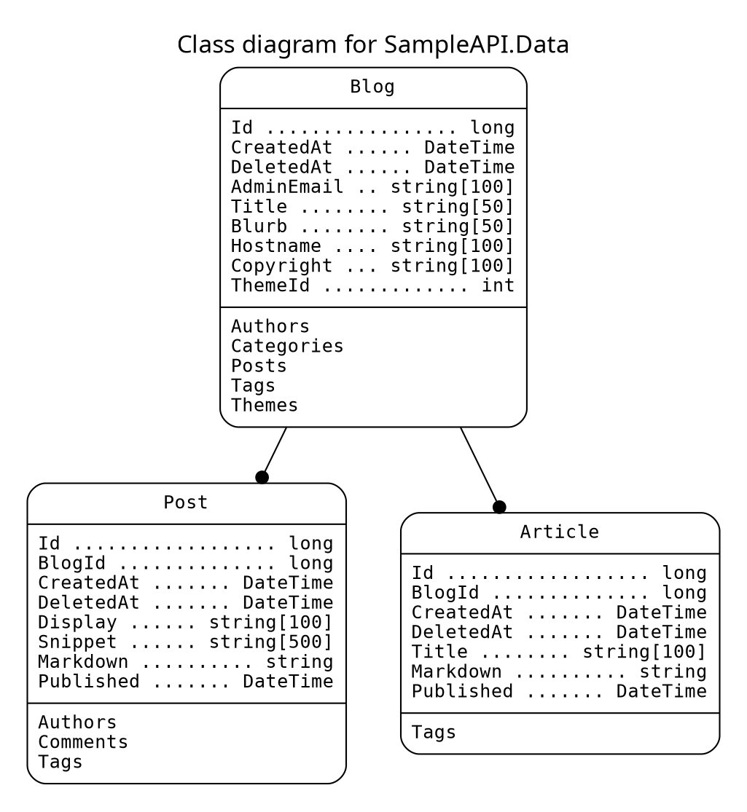

# NEWT

Autogenerate a .Net (C#/EF Core) data project (class library with entities and data contexts) from a Postgres database.
Also creates backup SQL and Graphviz `.dot` diagram source.

- [View the changelog](./CHANGELOG.md)

Note that whilst *this code repository* is AGPL there are specifically *no licensing constraints applied to generated output*.
You are free to apply any license you wish; generated code is entirely yours.

You *must* have the `dotnet` command installed.
In order to ensure compatible class library generation, your local `dotnet` installation is used at various points.

## What Newt does

Add the connection details for your Postgres database to your environment.

- Newt will then ...
    - Scan Postgres
    - Create a new .Net class library project
    - Add the required Nuget packages for EF Core
        - It will also restore them
    - Create EF Core data contexts
        - With automatic .Net class/property naming conventions
        - An InMemory context for testing etc
        - A Postgres context ready for use
    - Create entity models (classes) for each table
        - With automatic .Net class/property naming conventions
        - With data annotations for keys, types, lengths etc
        - With comments matching those for the database columns
        - With comments regarding where they map to
    - Create an emergency SQL script for everything generated
        - Tables, columns, primary/foreign keys, indexes etc
    - Create the `.dot` source for a *Graphviz* class diagram
        - With classes, properties, and foreign keys
- You can then ...
    - Include this in your solution (or generate it in-place)
    - Re-run any time you want an updated data project

## Status

This is *beta*. It works and is in active use.
Column defaults are not currently scripted in the backup SQL.

Make sure you check the database conventions in the contents (below).

---

## Contents

- [Running Newt](#running-newt)
- [Database conventions](#database-conventions)
    - [On foreign keys](#on-foreign-keys)
- [Output](#output)
    - [Created project files](#created-project-files)
    - [Created context](#created-context)
    - [Created entity](#created-entity)
    - [Created SQL](#created-sql)
    - [Created Graphviz](#created-graphviz)
- [Sample Usage](#sample-usage)
- [Generating stand-alone builds](#generating-stand-alone-builds)
    - It's easy to generate for a choice of platforms
    - Builds are small enough to be checked into source control

## Running Newt

The command arguments (which are always displayed at runtime) are as follows.

``` txt
NEWT (build 2022-05-28)
Generate a DotNet (C#/EF Core) data access repository project from a Postgres database.

-env       <value>   Environment variable containing the connection string (required)
-folder    <value>   Location of the new solution (and nested projects) (required)
-namespace <value>   The top level namespace for the generated C# code (required)
-schema    <value>   The database schema to generate code for (required)

-force               Overwrite any destination content 

Example:
  Newt -env DB_CONNSTR -folder "/Source/Core/SampleAPI" -namespace SampleAPI -schema public -force
```

Note that the destination `-folder` specifies the *parent* of where it should write to.
This is usually the *Solution* folder; a sub-folder will be created according to the `-namespace`.

For this to work, you need an environment variable containing a connection string.
That same environment variable name will be referenced in the generated EF context.

``` shell
export DB_CONNSTR="Server=127.0.0.1;Port=5432;Database=coregen;User Id=coregen;Password=coregen;"
```

The above is an example connection string, not a revealed secret.
This environment variable is also used by the auto-generated EF Core data context.

If you don't have a published Newt binary in your path you can run it from source:

``` shell
cd <solution>
dotnet run --project Newt -- -env DB_CONNSTR -schema public -folder ~/SampleAPI -namespace SampleAPI.Data --force
```

Note the extra `--` before `-env` which is *required*.

## Database conventions

Newt scans the specified Postgres database to generate code.
When it does so it needs to be able to understand, parse, and use what it finds.
This means certain conventions should be followed.

- *Postgres* naming conventions must be used, *not* C# ones
    - Table names are lower case snake (underscore delimited)
        - `customer_order` not `CustomerOrder` or `customerOrder`
    - They should also be in the singular form
        - `author` not `authors`
    - Columns names are *also* lower case snake (underscore delimited)
        - `display_name` not `DisplayName` or `displayName`
        - `id` not `ID` or `Id`
- Only one field in table primary keys

Some of these restrictions are expected to be removed in the near future.

### On foreign keys

Foreign keys can result in lists being added to entities.
Currently this only works for *belongs-to* not *has-a*.

For example:

- *has-a*
    - When `Blog` has `ThemeId` foreign key, but `Theme` doesn't have `BlogId` foreign key
    - The blog *has a* theme, but the theme does not *belong to* the blog
    - No theme list is added to the blog as the blog doesn't own it
- *belongs-to*
    - When `Post` has `BlogId` foreign key
    - The post *belongs to* the blog
    - A `List<Post>` *is added* to the `Blog` as posts *belong to* blogs

You only get a list in the *parent* entity if the *child* one has a foreign key *to it*.

## Output

The following represents generated output assuming a namespace of `SampleAPI.Data`.
The database has a `blog`, a `theme`, and a `post` table.

### Created project files

```
SampleAPI.Data/
    Entities/
        Blog.cs
        Post.cs
        Theme.cs
    SQL/
        Postgres.sql
    DataContext.cs
    InMemoryDataContext.cs
    SampleAPI.Data.csproj
    schema-dump.json
```

### Created context

``` cs
using System;
using Microsoft.EntityFrameworkCore;
using SampleAPI.Data.Entities;

namespace SampleAPI.Data
{
    public class DataContext : DbContext
    {
        public DbSet<Blog> Blogs { get; set; }
        public DbSet<Post> Posts { get; set; }
        public DbSet<Theme> Themes { get; set; }

        protected override void OnConfiguring(DbContextOptionsBuilder optionsBuilder)
        {
            var connectionString = Environment.GetEnvironmentVariable("DB_CONNSTR");
            optionsBuilder.UseNpgsql(connectionString);
        }
    }
}
```

### Created entity

(some columns/properties have been removed for brevity)

``` cs
using System;
using System.Collections.Generic;
using System.ComponentModel;
using System.ComponentModel.DataAnnotations;
using System.ComponentModel.DataAnnotations.Schema;

namespace SampleAPI.Data.Entities
{
    [Table("blog")]
    public class Blog
    {
        /// <summary>
        /// This line is taken from the comment in the Postgres column definition.
        /// The line below is auto-generated for every property.
        /// Database column `id` of type `bigint`.
        /// </summary>
        [Key]
        [Required]
        [Column("id")]
        [DisplayName("Id")]
        public long Id { get; set; }

        /// <summary>
        /// Database column `created_at` of type `timestamp with time zone`.
        /// </summary>
        [Required]
        [Column("created_at")]
        [DisplayName("Created At")]
        public DateTime CreatedAt { get; set; }

        /// <summary>
        /// Database column `deleted_at` of type `timestamp with time zone`.
        /// </summary>
        [Column("deleted_at")]
        [DisplayName("Deleted At")]
        public DateTime? DeletedAt { get; set; }

        /// <summary>
        /// For use in browser tabs, tables, lists etc.
        /// Database column `title` of type `character varying`.
        /// The capacity is 50.
        /// </summary>
        [MaxLength(50)]
        [Required]
        [Column("title")]
        [DisplayName("Title")]
        public string Title { get; set; }

        /// <summary>
        /// Database column `hostname` of type `character varying`.
        /// The capacity is 100.
        /// </summary>
        [MaxLength(100)]
        [Required]
        [Column("hostname")]
        [DisplayName("Hostname")]
        public string Hostname { get; set; }

        /// <summary>
        /// Database column `theme_id` of type `bigint`.
        /// </summary>
        [Required]
        [Column("theme_id")]
        [DisplayName("Theme Id")]
        public long ThemeId { get; set; }

        /// <summary>Foreign key on Post</summary>
        public List<Post> Posts { get; set; }
    }
}
```

### Created SQL

(the generated SQL is for emergency use only; it only includes what Newt uses)

``` sql
DROP TABLE public.blog CASCADE;
CREATE TABLE IF NOT EXISTS public.blog (
  id           BIGSERIAL NOT NULL,
  created_at   timestamp with time zone NOT NULL,
  deleted_at   timestamp with time zone,
  title        character varying(50) NOT NULL,
  display      character varying(200) NOT NULL,
  hostname     character varying(100) NOT NULL,
  theme_id     bigint NOT NULL,

  CONSTRAINT pk_blog PRIMARY KEY (id),
  CONSTRAINT uq_blog_hostname UNIQUE (hostname),
  CONSTRAINT fk_blog_theme FOREIGN KEY (theme_id)
    REFERENCES public.theme (id) MATCH SIMPLE 
    ON UPDATE NO ACTION ON DELETE NO ACTION
);
ALTER TABLE public.blog OWNER to sampleapi;
COMMENT ON COLUMN public.blog.title IS 'For use in browser tabs, tables, lists etc.';
```

### Created Graphviz

[Graphviz](https://graphviz.org) source is generated in a `schema.dot` file.
At the top of that file are sample commands to render it.

A Graphviz image generated from sample source is below, with the source itself underneath that.
Each class lists its properties then the other classes it is linked to by foreign keys.
For brevity most of the classes have been manually removed from the sample source and image.





## Sample Usage

Here's how it might be registered in `Program.cs` in .Net 6.
It assumes the created project is named `SampleApi.Data` and is referenced.

``` cs
// Program.cs

using SampleApi.Data;

builder.Services.AddScoped<DataContext>();
```

And here's how it might then be used in a controller in a `SampleApi.Api` project.

``` cs
// ThemeController.cs

using Microsoft.AspNetCore.Mvc;
using SampleApi.Data;
using SampleApi.Data.Entities;

namespace SampleApi.Api.Controllers;

[ApiController]
[Route("[controller]")]
public class ThemeController : ControllerBase
{
    private readonly ILogger<ThemeController> _logger;
    private readonly DataContext _context;

    public ThemeController(ILogger<ThemeController> logger, DataContext context)
    {
        _logger = logger;
        _context = context;
    }

    [HttpGet(Name = "ListThemes")]
    public IEnumerable<Theme> List()
    {
        return _context.Themes.OrderBy(x => x.Display).ToArray();
    }
}
```

## Generating stand-alone builds

This can be done with a single command as shown below.
There are a selection, each targeting a different output system.

The commands should be run from within the `Newt/Newt` *project* folder, not the solution.
Remember to update the build date in the `Program.cs` console output and the CHANGELOG.

``` shell
# Mac, Apple Silicon (eg M1)
dotnet build
dotnet publish -r osx-arm64 -c Release /p:PublishSingleFile=true /p:PublishTrimmed=true /p:IncludeNativeLibrariesForSelfExtract=true

# Mac, Intel
dotnet build
dotnet publish -r osx-x64 -c Release /p:PublishSingleFile=true /p:PublishTrimmed=true /p:IncludeNativeLibrariesForSelfExtract=true

# Linux, Intel
dotnet build
dotnet publish -r linux-x64 -c Release /p:PublishSingleFile=true /p:PublishTrimmed=true /p:IncludeNativeLibrariesForSelfExtract=true

# Windows, Intel
dotnet build
dotnet publish -r win10-x64 -c Release /p:PublishSingleFile=true /p:PublishTrimmed=true /p:IncludeNativeLibrariesForSelfExtract=true
```

Whichever command you choose to run, it will tell you in its response where it has placed the binary.
Copy that somewhere accessible via your system path and you can run it from anywhere.

For example (MacOS):

``` sh
sudo rm /usr/local/bin/newt
sudo cp ~/Source/Core/Newt/Newt/bin/Release/net6.0/osx-arm64/publish/Newt /usr/local/bin/newt
```

*The binary is very small (about 20MB) so you can also check it into source control alongside your main project.*
