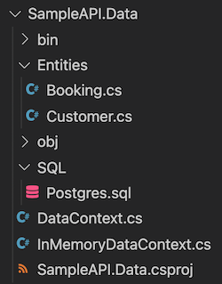
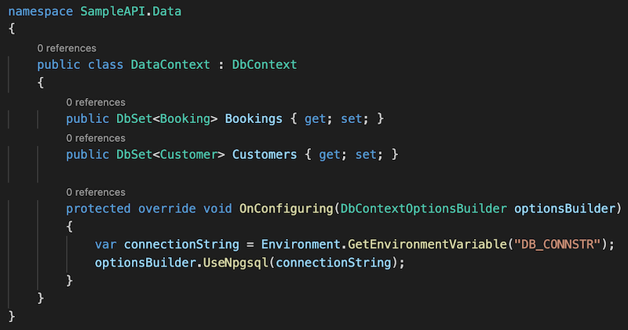
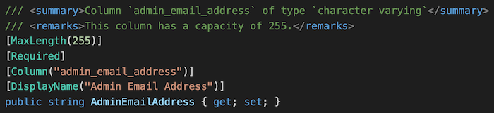

# NEWT

Generate a .Net (C#/EF Core) data project (class library) from a Postgres database.

- [View the changelog](./CHANGELOG.md)

Note that whilst *this code repository* is AGPL there are specifically *no licensing constraints applied to generated output*.
You are free to apply any license you wish; generated code is entirely yours.

You *must* have the `dotnet` command installed.
In order to ensure compatible class library generation, your local `dotnet` installation is used at various points.

## What Newt does

Add the connection details for your Postgres database to your environment.

- Newt will then ...
    - Scan Postgres
    - Create a new .Net class library project
    - Add the required Nuget packages for EF Core
        - It will also restore them
    - Create EF Core data contexts
        - With automatic .Net class/property naming conventions
        - An InMemory context for testing etc
        - A Postgres context ready for use
    - Create entity models (classes) for each table
        - With automatic .Net class/property naming conventions
        - With data annotations for keys, types, lengths etc
        - With comments regarding where they map to
    - Create an emergency SQL script for everything generated
        - Tables, columns, primary/foreign keys, indexes etc
- You can then ...
    - Include this in your solution (or generate it in-place)
    - Re-run any time you want an updated data project

## Status

This is *beta*. It works and is in active use.
However there are issues with tables without primary keys, for example.

---

## Contents

- [Usage](#usage)
- [Command arguments](#command-arguments)
- [Sample session](#sample-session)
- [Database conventions](#database-conventions)
- [Output](#output)
- [Generating stand-alone builds](#generating-stand-alone-builds)
    - It's easy to generate for a choice of platforms
    - Builds are small enough to be checked into source control

## Usage

You need an environment variable containing a connection string.
That same environment variable name will be referenced in the generated EF context.

``` shell
export DB_CONNSTR="Server=127.0.0.1;Port=5432;Database=coregen;User Id=coregen;Password=coregen;"
```

*(The above is an example connection string, not a revealed secret.)*

Running Newt will use that to scan the database structure and generate code.
There are two commands shown. The second is for if you have a published binary in your path.

``` shell
dotnet run --project Newt -- -env DB_CONNSTR -schema public -folder ~/SampleAPI -namespace SampleAPI.Data --force
Newt -env DB_CONNSTR -schema public -folder ~/SampleAPI -namespace SampleAPI.Data --force
```

## Command arguments

The command arguments (which are always displayed at runtime) are as follows.

``` shell
Newt -env <environment_variable> -schema <schema> -folder <destination> -namespace <namespace> [--force]
```

| Name      | Purpose                               | Example                   |
|-----------|---------------------------------------|---------------------------|
| env       | Variable containing connection string | `DB_CONNSTR`              |
| schema    | Database schema to generate code for  | `public`                  |
| folder    | Where to write generated code         | `~/source/core/SampleAPI` |
| namespace | Namespace to place C# code in         | `SampleAPI.Data`          |
| --force   | Allow overwriting *(optional)*        | `--force`                 |

Note that the destination `-folder` specifies the *parent* of where it should write to.
This is usually the *Solution* folder; a sub-folder will be created according to the `-namespace`.

## Sample session

This is an example of the session display when Newt is run.

``` txt
NEWT (build 2022-05-27)
Generate a DotNet (C#/EF Core) data access repository project from a Postgres database.

-env       <value>   Environment variable containing the connection string (required)
-folder    <value>   Location of the new solution (and nested projects) (required)
-namespace <value>   The top level namespace for the generated C# code (required)
-schema    <value>   The database schema to generate code for (required)

-force               Overwrite any destination content 

Example:
  Newt --force -env DB_CONNSTR -schema public -folder "/Source/Core/SampleAPI" -namespace SampleAPI


COMMAND ARGUMENTS
Environment = DB_CONNSTR
DB Schema   = public
Folder      = /example-path/Source/Core/SampleAPI
Namespace   = SampleAPI.Data
Force?      = True
Destination = /example-path/Source/Core/SampleAPI/SampleAPI.Data

SCANNING DATABASE
Database    = SampleAPI
Tables      = 4

CLEARING EXISTING
/example-path/Source/Core/SampleAPI/SampleAPI.Data
/example-path/Source/Core/SampleAPI/SampleAPI.Data/obj
/example-path/Source/Core/SampleAPI/SampleAPI.Data/bin
/example-path/Source/Core/SampleAPI/SampleAPI.Data/Entities
/example-path/Source/Core/SampleAPI/SampleAPI.Data/SQL

DATA PROJECT
Creating project
Removing default class file

SQL SCRIPT
/example-path/Source/Core/SampleAPI/SampleAPI.Data/SQL
/example-path/Source/Core/SampleAPI/SampleAPI.Data/SQL/Postgres.sql

ENTITIES
/example-path/Source/Core/SampleAPI/SampleAPI.Data/Entities
/example-path/Source/Core/SampleAPI/SampleAPI.Data/Entities/Author.cs
/example-path/Source/Core/SampleAPI/SampleAPI.Data/Entities/Blog.cs
/example-path/Source/Core/SampleAPI/SampleAPI.Data/Entities/Item.cs
/example-path/Source/Core/SampleAPI/SampleAPI.Data/Entities/Topic.cs

EF CORE CONTEXTS
/example-path/Source/Core/SampleAPI/SampleAPI.Data/DataContext.cs
/example-path/Source/Core/SampleAPI/SampleAPI.Data/InMemoryDataContext.cs

NUGET PACKAGES
Adding nuget references

DONE
```

## Database conventions

Newt scans the specified Postgres database to generate code.
When it does so it needs to be able to understand, parse, and use what it finds.
This means certain conventions should be followed.

- *Postgres* naming conventions must be used, *not* C# ones
    - Table names are lower case snake (underscore delimited)
        - `customer_order` not `CustomerOrder` or `customerOrder`
    - They should also be in the singular form
        - `author` not `authors`
    - Columns names are *also* lower case snake (underscore delimited)
        - `display_name` not `DisplayName` or `displayName`
        - `id` not `ID` or `Id`
- Only one field in table primary keys

Some of these restrictions are expected to be removed in the near future.

## Output

The following represents generated output assuming a namespace of `SampleAPI.Data`.
The database has a `customer` and a `booking` table.
The `customers` table has an `admin_email_address` column.

### Created project files



### Created context



### Created column



## Generating stand-alone builds

This can be done with a single command as shown below.
There are a selection, each targeting a different output system.

The commands should be run from within the `Newt/Newt` *project* folder, not the solution.
Remember to update the build date in the `Program.cs` console output.

``` shell
# Mac, Apple Silicon (eg M1)
dotnet build
dotnet publish -r osx-arm64 -c Release /p:PublishSingleFile=true /p:PublishTrimmed=true /p:IncludeNativeLibrariesForSelfExtract=true

# Mac, Intel
dotnet build
dotnet publish -r osx-x64 -c Release /p:PublishSingleFile=true /p:PublishTrimmed=true /p:IncludeNativeLibrariesForSelfExtract=true

# Linux, Intel
dotnet build
dotnet publish -r linux-x64 -c Release /p:PublishSingleFile=true /p:PublishTrimmed=true /p:IncludeNativeLibrariesForSelfExtract=true

# Windows, Intel
dotnet build
dotnet publish -r win10-x64 -c Release /p:PublishSingleFile=true /p:PublishTrimmed=true /p:IncludeNativeLibrariesForSelfExtract=true
```

Whichever command you choose to run, it will tell you in its response where it has placed the binary.
Copy that somewhere accessible via your system path and you can run it from anywhere.

For example (MacOS):

``` sh
sudo rm /usr/local/bin/newt
sudo cp ~/Source/Core/Newt/Newt/bin/Release/net6.0/osx-arm64/publish/Newt /usr/local/bin/newt
```

*The binary is very small (about 20MB) so you can also check it into source control alongside your main project.*
