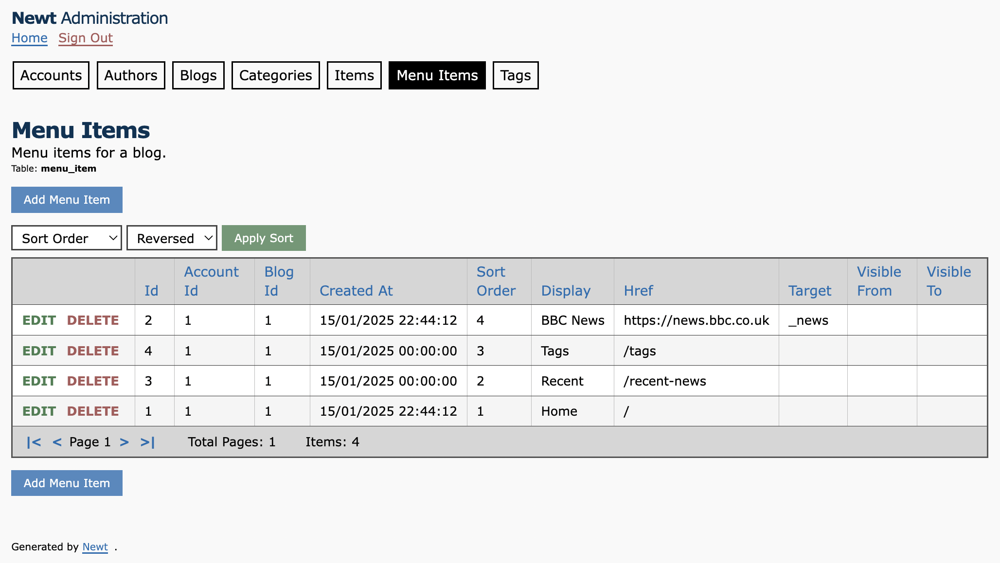

# NEWT

Autogenerate a .Net (C#/EF Core) *data project* (class library with entities and data contexts) and an *admin website* from a Postgres database.
Also creates backup SQL and Graphviz `.dot` diagram source.

If a Solution doesn't exist in the main folder then a new one is created.
The Data and optional Web project are both added to it.
*Existing Solution files are not updated.*

*Requires dotnet 6.0.3 or later to be installed.*

- [View the changelog](./CHANGELOG.md)

There are [pre-built executables](./builds) ready to run for Linux, Mac, and Windows.

Note that whilst *this code repository* is AGPL there are specifically *no licensing constraints applied to generated output*.
You are free to apply any license you wish; generated code is entirely yours.

You *must* have the `dotnet` command installed (v6+), even if using a pre-built Newt executable, as it is used to create your new project and add packages to it.

## What Newt does

Add the connection details for your Postgres database to your environment.

- Newt will then ...
    - Scan Postgres
    - Create a new .Net class library *data project*
    - Add the required Nuget packages for EF Core
        - It will also restore them
    - Create EF Core data contexts
        - With automatic .Net class/property naming conventions
        - An InMemory context for testing etc
        - A Postgres context ready for use
    - Optionally create an ASP.Net MVC Web project
    - Create a Solution file if one doesn't already exist
        - Add the Data and optional Web project to it
    - Create entity models (classes) for each table
        - With automatic .Net class/property naming conventions
        - With data annotations for keys, types, lengths etc
        - With comments matching those for the database columns
        - With comments regarding where they map to
    - Create an emergency SQL script for everything generated
        - Tables, columns, primary/foreign keys, indexes etc
    - Create the `.dot` source for a *Graphviz* class diagram
        - With classes, properties, and foreign keys
    - Create an *admin web site*
        - Gneerate login page
        - Generate admin pages
            - Include column sorting and table paging
- You can then ...
    - Include this in your solution (or generate it in-place)
    - Re-run any time you want an updated data project
    - Maintain things with the admin website
    - Or use that as the basis for an actual site

## Status

This is *beta*. It works and is in active use.
Make sure you check the database conventions in the contents (below).

There are [pre-built executables](./builds) ready to run for Linux, Mac, and Windows.

---

## Contents

- [Running Newt](#running-newt)
- [Database conventions](#database-conventions)
    - [On foreign keys](#on-foreign-keys)
- [Output](#output)
    - [Created project files](#created-project-files)
    - [Created context](#created-context)
    - [Created entity](#created-entity)
    - [Created SQL](#created-sql)
    - [Created Graphviz](#created-graphviz)
- [Sample Usage](#sample-usage)
- [Copying a build to somewhere convenient](#copying-a-build-to-somewhere-convenient)

---

For Newt developers only:

- [Generating stand-alone builds](#generating-stand-alone-builds)
    - [For all target systems in one go](#for-all-target-systems-in-one-go)
    - [For a single target system](#for-a-single-target-system)

## Running Newt

The command arguments (which are always displayed at runtime) are as follows.

``` txt
NEWT (build 2024-08-11)

Generates a DotNet (C#/EF Core) data access repository project from a Postgres database.
Optionally also creates a matching MVC site for data management.

If the parent folder has no solution it will be created and the project(s) added.
Existing solutions will NOT be updated to include new project(s).

The solution name is used if a new solution needs creating.
Namespaces will also be used as project names/subfolders.


USAGE:

  -env  text  * Environment variable containing the connection string  
  -s    text  * The database schema to generate code for  
  -f    text  * The parent folder for the solution  
  -sln  text  * The solution name/namespace  
  -dn   text  * The C# data project name/namespace  
  -wn   text    The C# MVC web project name/namespace  
  -od           Overwrite existing data project
  -ow           Overwrite existing web project
  -os           Overwrite existing solution

  * is required

EXAMPLE:

  Newt -env DB_CONNSTR -s public -f ./sample -sln Sample -dn Data -wn Admin
```

Note that the destination `-f` specifies the *parent* of where it should write to.  This is usually the *Solution* folder; a sub-folder will be created according to the `-sln` name/namespace.

For this to work, you need an environment variable containing a connection string.
That same environment variable name will be referenced in the generated EF context.

``` shell
export DB_CONNSTR="Server=127.0.0.1;Port=5432;Database=coregen;User Id=coregen;Password=coregen;"
```

*The above is an example connection string, not a revealed secret.*

This environment variable is also used by the auto-generated EF Core data context.

On Windows if you use the `set` command rather than `export` then ensure you don't accidentally include the double quotes (`"`) surrounding the value.  If you do, you'll get a message similar to "*Format of the initialization string does not conform to specification starting at index ...*" - in which case the simple solution is to use the Control Panel to set the Environment Variable value.

If you don't have a published Newt binary in your path you can run it from source:

``` shell
cd <solution>
dotnet run --project Newt -- -env DB_CONNSTR -s public -f ~/sample -sln Sample -dn Data -wn Admin -od -ow
```

Note the extra `--` before `-env` which is *required* for the dotnet CLI to recognise which options it should interpret itself (those to the left) and which it should pass to Newt (those to the right).

If a Solution file doesn't alrady exist at the top level a new one is created.

If you provide a `-wn` parameter then an ASP.Net MVC Web project is also created.
When a new solution has been requested any created projects are added to it.

Efforts are made to not 'damage' any enclosing solution as it may be your own code.

As a precaution you are *strongly advised* to commit to source control before running to avoid overwriting things you want to keep!

## Database conventions

Newt scans the specified Postgres database to generate code.
When it does so it needs to be able to understand, parse, and use what it finds.
This means certain conventions should be followed.

- *Postgres* naming conventions must be used, *not* C# ones
    - Table names are lower case snake (underscore delimited)
        - `customer_order` not `CustomerOrder` or `customerOrder`
    - They should also be in the singular form
        - `author` not `authors`
    - Columns names are *also* lower case snake (underscore delimited)
        - `display_name` not `DisplayName` or `displayName`
        - `id` not `ID` or `Id`
- Only one field in table primary keys

Some of these restrictions are expected to be removed in the near future.

### On foreign keys

Foreign keys can result in lists being added to entities.
Currently this only works for *belongs-to* not *has-a*.

For example:

- *has-a*
    - When `Blog` has `ThemeId` foreign key, but `Theme` doesn't have `BlogId` foreign key
    - The blog *has a* theme, but the theme does not *belong to* the blog
    - No theme list is added to the blog as the blog doesn't own it
- *belongs-to*
    - When `Post` has `BlogId` foreign key
    - The post *belongs to* the blog
    - A `List<Post>` *is added* to the `Blog` as posts *belong to* blogs

You only get a list in the *parent* entity if the *child* one has a foreign key *to it*.

## Output

The following represents generated output assuming a namespace of `Sample.Data`.
The database has an `article`, a `blog`, and a `post` table.

### Created project files

You will optionally get a Solution and possibly a Web (admin) project.
They are standard off-the shelf projects.

Here's the Data project's files/folders:

```
Sample.Data/
    Entities/
        Article.cs
        Blog.cs
        Post.cs
    SQL/
        Postgres.sql
    DataContext.cs
    InMemoryDataContext.cs
    Sample.Data.csproj
    schema-dump.json
```

Here's an example of the Admin website.



### Created context

``` cs
using System;
using Microsoft.EntityFrameworkCore;
using Sample.Data.Entities;

namespace Sample.Data
{
    public class DataContext : DbContext
    {
        public DbSet<Article> Articles { get; set; }
        public DbSet<Blog> Blogs { get; set; }
        public DbSet<Post> Posts { get; set; }

        protected override void OnConfiguring(DbContextOptionsBuilder optionsBuilder)
        {
            var connectionString = Environment.GetEnvironmentVariable("DB_CONNSTR");
            optionsBuilder.UseNpgsql(connectionString);
        }
    }
}
```

### Created entity

(some columns/properties have been removed for brevity)

``` cs
using System;
using System.Collections.Generic;
using System.ComponentModel;
using System.ComponentModel.DataAnnotations;
using System.ComponentModel.DataAnnotations.Schema;

namespace Sample.Data.Entities
{
    /// <summary>
    /// Contains the definition of a single blog site.
    /// </summary>
    [Table("blog")]
    public class Blog
    {
        /// <summary>
        /// This line is taken from the comment in the Postgres column definition.
        /// The line below is auto-generated for every property.
        /// Database column `id` of type `bigint`.
        /// </summary>
        [Key]
        [Required]
        [Column("id")]
        [DisplayName("Id")]
        public long Id { get; set; }

        /// <summary>
        /// Database column `created_at` of type `timestamp with time zone`.
        /// </summary>
        [Required]
        [Column("created_at")]
        [DisplayName("Created At")]
        public DateTime CreatedAt { get; set; }

        /// <summary>
        /// Database column `deleted_at` of type `timestamp with time zone`.
        /// </summary>
        [Column("deleted_at")]
        [DisplayName("Deleted At")]
        public DateTime? DeletedAt { get; set; }

        /// <summary>
        /// For use in browser tabs, tables, lists etc.
        /// Database column `title` of type `character varying`.
        /// The capacity is 50.
        /// </summary>
        [MaxLength(50)]
        [Required]
        [Column("title")]
        [DisplayName("Title")]
        public string Title { get; set; }

        /// <summary>
        /// Database column `hostname` of type `character varying`.
        /// The capacity is 100.
        /// </summary>
        [MaxLength(100)]
        [Required]
        [Column("hostname")]
        [DisplayName("Hostname")]
        public string Hostname { get; set; }

        /// <summary>
        /// Database column `theme_id` of type `bigint`.
        /// </summary>
        [Required]
        [Column("theme_id")]
        [DisplayName("Theme Id")]
        public long ThemeId { get; set; }

        /// <summary>Foreign key on Article</summary>
        public List<Article> Articles { get; set; }

        /// <summary>Foreign key on Post</summary>
        public List<Post> Posts { get; set; }
    }
}
```

### Created SQL

(the generated SQL is for emergency use only; it only includes what Newt uses)

``` sql
DROP TABLE public.blog CASCADE;
CREATE TABLE IF NOT EXISTS public.blog (
  id           BIGSERIAL NOT NULL,
  created_at   timestamp with time zone NOT NULL,
  deleted_at   timestamp with time zone,
  title        character varying(50) NOT NULL,
  display      character varying(200) NOT NULL,
  hostname     character varying(100) NOT NULL,
  theme_id     bigint NOT NULL DEFAULT 1,

  CONSTRAINT pk_blog PRIMARY KEY (id),
  CONSTRAINT uq_blog_hostname UNIQUE (hostname),
  CONSTRAINT fk_blog_theme FOREIGN KEY (theme_id)
    REFERENCES public.theme (id) MATCH SIMPLE 
    ON UPDATE NO ACTION ON DELETE NO ACTION
);
ALTER TABLE public.blog OWNER to sample;
COMMENT ON TABLE public.blog IS 'Contains the definition of a single blog site.';
COMMENT ON COLUMN public.blog.title IS 'For use in browser tabs, tables, lists etc.';
```

### Created Graphviz

[Graphviz](https://graphviz.org) source is generated in a `schema.dot` file.
At the top of that file are sample commands to render it.

A Graphviz image generated from sample source is below, with the source itself underneath that.
Each class lists its properties then the other classes it is linked to by foreign keys.
For brevity most of the classes have been manually removed from the sample source and image.

Click the image below to open it directly.
When using Github or similar, you may also need to click for the *Raw* file.


## Sample Usage

Here's how it might be registered in `Program.cs` in .Net 6.
It assumes the created project is named `Sample.Data` and is referenced.

``` cs
// Program.cs

using Sample.Data;

builder.Services.AddScoped<DataContext>();
```

*Important note:*
If you added the connection string environment variable *after* starting your IDE/editor, then you will usually need to restart it.  Any debug/release runs will likely be unable to connect until you do, as the OS only makes available the environment variables that already existed at the time your IDE/editor was launched.

And here's how it might then be used in a controller in a `Sample.UI` project.

``` cs
// ArticlesController.cs

using Microsoft.AspNetCore.Mvc;
using Sample.Data;
using Sample.Data.Entities;

namespace Sample.UI.Controllers;

[ApiController]
[Route("[controller]")]
public class ArticlesController : ControllerBase
{
    private readonly ILogger<ArticlesController> _logger;
    private readonly DataContext _context;

    public ArticlesController(ILogger<ArticlesController> logger, DataContext context)
    {
        _logger = logger;
        _context = context;
    }

    [HttpGet(Name = "ListArticles")]
    public IEnumerable<Article> List()
    {
        return _context.Articles.OrderBy(x => x.Title).ToArray();
    }
}
```

## Copying a build to somewhere convenient

Copy a build to somewhere accessible via your system path and you can run it from anywhere.

For example (Mac):

``` sh
cd <solution>
sudo rm -rf /usr/local/bin/Newt
sudo cp builds/macos-arm64/Newt /usr/local/bin/Newt
```

Alternatively, as builds are pretty small you can include ones for relevant platforms directly into your own project's repository.

---

**What follows if for Newt developers only. You don't need to read this if you are only using Newt as a tool for your own projects.**

## Generating stand-alone builds

The commands below should be run from within the `Newt/Newt` *project* folder, not the solution. Remember to update the build date in the `Program.cs` console output, README output capture, and the CHANGELOG.
There are also details available regarding [copying a build to somewhere convenient](#copying-a-build-to-somewhere-convenient).

*Do not check in new builds automatically every commit*; only do so when a genuine version and release change occurs.

### For all target systems in one go

There are two scripts you can run in the *project* folder.
If you are building on Linux/Mac use `build.sh` and on Windows use `build.bat`.

Linux/Mac:

```sh
cd <project>
chmod +x build.sh   # for reference; not usually needed
./build.sh
```

Windows:

```bat
cd <project>
build.bat
```

Upon completion, both scripts will advise what builds are now available.

### For a single target system

``` shell
# Mac, Apple Silicon (eg M1)
dotnet build
dotnet publish -r osx-arm64 -c Release /p:PublishSingleFile=true /p:PublishTrimmed=true /p:IncludeNativeLibrariesForSelfExtract=true

# Mac, Intel
dotnet build
dotnet publish -r osx-x64 -c Release /p:PublishSingleFile=true /p:PublishTrimmed=true /p:IncludeNativeLibrariesForSelfExtract=true

# Linux, Intel
dotnet build
dotnet publish -r linux-x64 -c Release /p:PublishSingleFile=true /p:PublishTrimmed=true /p:IncludeNativeLibrariesForSelfExtract=true

# Windows, Intel
dotnet build
dotnet publish -r win10-x64 -c Release /p:PublishSingleFile=true /p:PublishTrimmed=true /p:IncludeNativeLibrariesForSelfExtract=true
```

Whichever command you choose to run, it will tell you in its response where it has placed the binary.